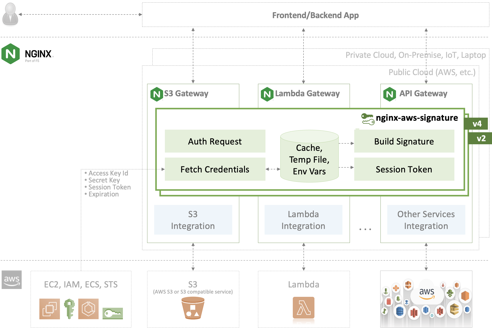
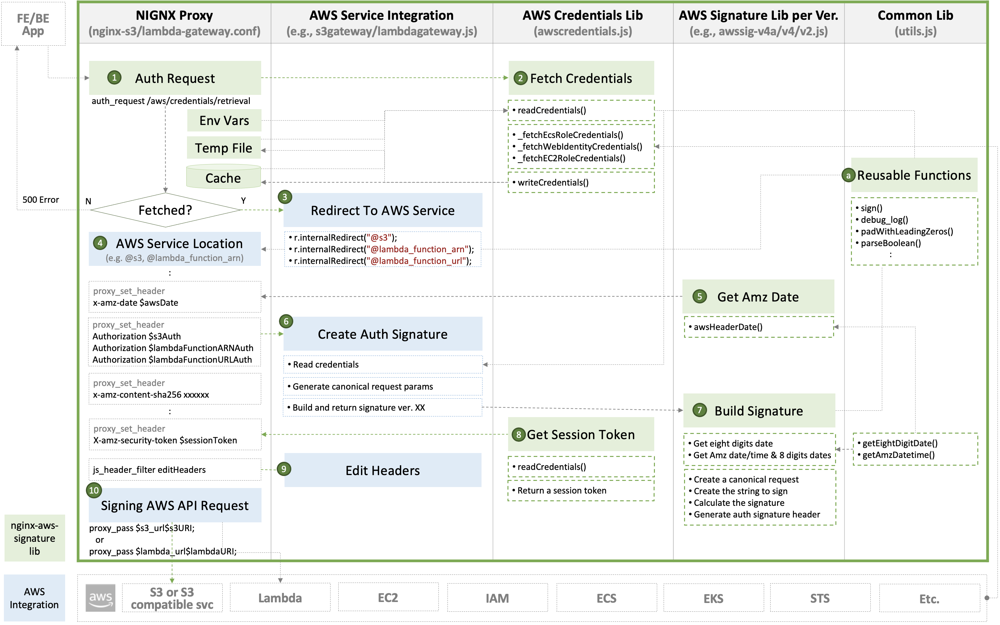

# nginx_aws_signature

NGINX AWS Signature Library to authenticate AWS services such as S3 and Lambda via NGINX and NGINX Plus.



**TABLE OF CONTENTS:**

- [Getting Started](#getting-started)
- [Directory Structure and File Descriptions](#directory-structure-and-file-descriptions)
- [NGINX AWS Signature Signing Flow](#nginx-aws-signature-signing-flow)
- [How to Use](#how-to-use)
- [Contributing](#contributing)
- [Authors and acknowledgment](#authors-and-acknowledgment)
- [License](#license)

## Getting Started

This project is to provide the common library for your apps or services. To get this project up and running, the following nginx project can be used prior to implementing your project.

- [Getting Started with `nginx-s3-gateway`](https://github.com/nginxinc/nginx-s3-gateway#getting-started)
- [Getting Started with `nginx-lambda-gateway`](https://github.com/nginx-serverless/nginx-lambda-gateway#getting-started)

## Directory Structure and File Descriptions

```
nginx-aws-signature
│
├── core
│   ├── awscredentials.js       common lib to read and write AWS credentials
│   ├── awssig2.js              common lib to build AWS signature v2
│   ├── awssig4.js              common lib to build AWS signature v4
│   │                           :
│   │                           add new lib when AWS releases new signature ver.
│   │                           :
│   └── utils.js                common lib to be reused by all NJS codebase
│
├── tests
│   ├── docker
│   │   ├── build_text          Docker environments for testing NJS codebases
│   │   │   ├── nginx           NGINX config files for testing NJS codebases
│   │   │   └── ssl             NGINX Plus license files when testing lib on NGINX Plus
│   │   ├── Dockerfile.oss      for testing AWS signaure lib on NGINX OSS
│   │   ├── Dockerfile.plus     for testing AWS signaure lib on NGINX Plus
│   │   └── docker-compose.yml  to build and run a container for testing AWS signaure lib
│   ├── unit-test               contains automated tests for validang that the lib works
│   └── test.sh                 test launcher
│
└── Makefile                    automate to build/start/stop testing environment
```

## NGINX AWS Signature Signing Flow



## How to Use

### Sparse Checkouts of Submodules

Create or update `git submodule` when using this lib in your repository. Otherwise, skip the following steps, and copy [`core/*.js`](./core/) into the prefered directory on your NGINX instance.

#### Step 1. Choose one of the following options
- Option 1. Clone this repo with a depth of 1 for the first time
  ```bash
  git clone --depth=1 --no-checkout git@github.com:nginxinc/nginx-aws-signature.git <path/to/submodule>
  ```

- Option 2. Update a submodule when using the latest lib after cloning
  ```bash
  git submodule update --init <path/to/submodule>
  ```

#### Step 2. Sparse checkouts of submodules

```bash
git submodule absorbgitdirs
git -C <path/to/submodule> config core.sparseCheckout true
echo 'core/*' >>.git/modules/<path/to/submodule>/info/sparse-checkout
git submodule update --force --checkout <path/to/submodule>
```

### Configure NGINX

```nginx
js_import /etc/nginx/awssig/awscredentials.js;
js_import /etc/nginx/awssig/awssig4.js;
js_import /etc/nginx/serverless/lambdagateway.js;

js_set $awsDate                 awssig4.awsHeaderDate;
js_set $awsPayloadHash          awssig4.awsHeaderPayloadHash;
js_set $awsSessionToken         awscredentials.sessionToken;
js_set $lambdaFunctionARNAuth   lambdagateway.lambdaFunctionARNAuth;
js_var $defaultHostName         'nginx-lambda-gateway';

map $request_uri $lambda_url {
    default  https://lambda.us-east-1.amazonaws.com;
}

server {
    listen 80; # Use SSL/TLS in production

    location /2015-03-31/functions/foo/invocations {
        auth_request /aws/credentials/retrieval;
        proxy_set_header x-amz-date           $awsDate;
        proxy_set_header x-amz-content-sha256 $awsPayloadHash;
        proxy_set_header x-amz-security-token $awsSessionToken;
        proxy_set_header Authorization        $lambdaFunctionARNAuth;
        proxy_pass $lambda_url$request_uri;
    }

    location /aws/credentials/retrieval {
        internal;
        js_content awscredentials.fetchCredentials;
    }
}
```

**Examples:**

| Project                | Config example                           |
|------------------------|------------------------------------------|
| `nginx-s3-gateway`     | [`/etc/nginx/conf.d/default.conf`](https://github.com/nginxinc/nginx-s3-gateway/blob/master/common/etc/nginx/templates/default.conf.template) |
| `nginx-lambda-gateway` | [`/etc/nginx/conf.d/nginx_lambda_gateway.conf`](https://github.com/nginx-serverless/nginx-lambda-gateway/blob/main/common/etc/nginx/conf.d/nginx_lambda_gateway.conf) |


### Integrate AWS Signature Lib To Your Custom NJS

Import library files of `nginx-aws-signature`, and implement a function to generate `Authorization` header by using the lib with the proper parameters in your custom NJS.

`/etc/nginx/<custom-njs-path>/<your-njs>.js`:

```njs
import awscred from "../awssig/awscredentials.js";
import awssig4 from "../awssig/awssig4.js";
import utils   from "../awssig/utils.js";

const SERVICE = 'lambda';

utils.requireEnvVar('LAMBDA_SERVER');
utils.requireEnvVar('LAMBDA_REGION');

function lambdaFunctionARNAuth(r) {
    const host   = process.env['LAMBDA_SERVER'];
    const region = process.env['LAMBDA_REGION'];
    const queryParams = '';
    const credentials = awscred.readCredentials(r);

    const signature = awssig4.signatureV4(
        r, awscred.Now(), region, SERVICE,
        r.variables.request_uri, queryParams, host, credentials
    );
    return signature;
}
```

**Examples:**

| Project                | NJS example                              |
|------------------------|------------------------------------------|
| `nginx-s3-gateway`     | [`s3gateway.js`](https://github.com/nginxinc/nginx-s3-gateway/blob/master/common/etc/nginx/include/s3gateway.js) |
| `nginx-lambda-gateway` | [`lambdagateway.js`](https://github.com/nginx-serverless/nginx-lambda-gateway/blob/main/common/lambda-core/lambdagateway.js) | 

## Contributing

Please see the [contributing guide](https://github.com/nginxinc/nginx-aws-signature/blob/main/CONTRIBUTING.md) for guidelines on how to best contribute to this project.

## Authors and acknowledgment

This project was inspired the on the great work by [nginx-s3-gateway](https://github.com/nginxinc/nginx-s3-gateway) and [nginx-serverless](https://github.com/nginx-serverless).

## License

[Apache License, Version 2.0](https://github.com/nginxinc/nginx-aws-signature/blob/main/LICENSE)

&copy; [F5, Inc.](https://www.f5.com/) 2023
