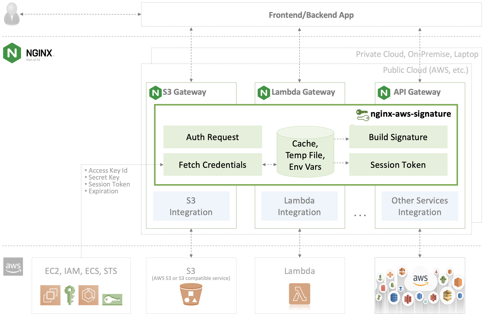

# nginx_aws_signature

NGINX AWS Signature Library to authenticate AWS services such as S3 and Lambda via NGINX and NGINX Plus.



## Getting Started


## Directory Structure and File Descriptions

```
nginx-aws-signature
│
├── core
│   ├── awscredentials.js       common lib to read and write AWS credentials
│   ├── awssig2.js              common lib to build AWS signature v2
│   ├── awssig4.js              common lib to build AWS signature v4
│   │                           :
│   │                           add new lib when AWS releases new signature ver.
│   │                           :
│   └── utils.js                common lib to be reused by all NJS codebase
│
├── tests
│   ├── docker
│   │   ├── build_text          Docker environments for testing NJS codebases
│   │   │   ├── nginx           NGINX config files for testing NJS codebases
│   │   │   └── ssl             NGINX Plus license files when testing lib on NGINX Plus
│   │   ├── Dockerfile.oss      for testing AWS signaure lib on NGINX OSS
│   │   ├── Dockerfile.plus     for testing AWS signaure lib on NGINX Plus
│   │   └── docker-compose.yml  to build and run a container for testing AWS signaure lib
│   ├── unit-test               contains automated tests for validang that the lib works
│   └── test.sh                 test launcher
│
└── Makefile                    automate to build/start/stop testing environment
```

## How to Use

TBD

## Contributing

Please see the [contributing guide](https://github.com/nginxinc/nginx-aws-signature/blob/main/CONTRIBUTING.md) for guidelines on how to best contribute to this project.

## Authors and acknowledgment

This project was inspired the on the great work by [nginx-s3-gateway](https://github.com/nginxinc/nginx-s3-gateway) and [nginx-serverless](https://github.com/nginx-serverless).

## License

[Apache License, Version 2.0](https://github.com/nginxinc/nginx-aws-signature/blob/main/LICENSE)

&copy; [F5, Inc.](https://www.f5.com/) 2023
